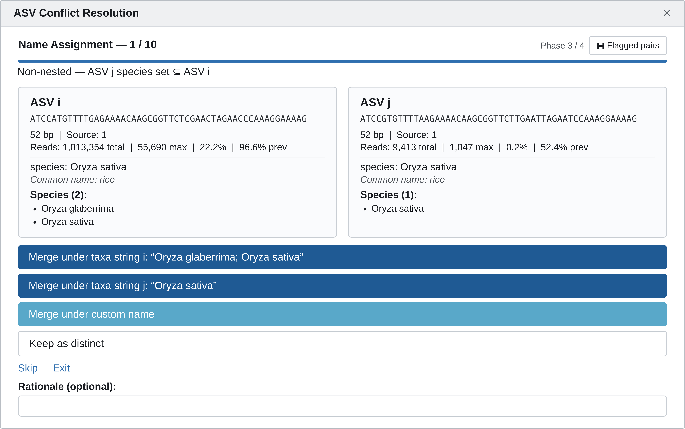

# Agglomerating Taxa

Agglomeration groups ASVs that represent the same organism — whether because they were sequenced at slightly different lengths, assigned at different taxonomic resolutions, or are simply redundant with one another — into a single representative taxon. This step happens after [pruning taxa](pruning.md) and before [calculating diversity](diversity.md), once taxa filtering, sample filtering, and pruning have already settled which ASVs and samples are in play. The approach differs by marker.

=== "trnL"

    trnL agglomeration works differently: rather than grouping by taxonomic rank alone, it detects ASVs that likely represent the same organism across (or within) sequencing batches — near-identical sequences, differing resolutions, overlapping or subset taxonomy — and merges them once a human has reviewed the ambiguous cases. Two functions handle this: **`plan_harmonization()`** and **`apply_harmonization()`**, both part of the `foodseq.tools` package. Install it if you haven't already, then load it:

    ``` r
    # install.packages("devtools")
    devtools::install_github("LAD-LAB/foodseq.tools")

    library(foodseq.tools)
    ```

    ### Prerequisite

    Both functions expect the `taxa` and `common_name` columns added by [`assign_common_names()`](commonnames.md#assign_common_names-function) to already be present in your phyloseq's tax table.

    ### Overview
    **Overview of the trnL harmonization workflow.** Purple shapes show the automated pairwise comparison, in which plan_harmonization() compares every pair of ASVs and sorts it into a scenario (S1–S5) based on sequence and taxonomy. Yellow boxes are the steps that require user input: reviewing each flagged pair and, optionally, choosing a representative ASV. Everything in green is automated, including flagging pairs for review, applying the accepted decisions with apply_harmonization(), and writing the decisions log and harmonized phyloseq object. 

    ``` mermaid
    flowchart TD
    
    ASVI["ASV i"]
    ASVJ["ASV j"]
    
    Q1{"Substring<br/>match?"}
    Q2{"Shared<br/>lineage?"}
    Q3{"Shared<br/><span style='font-family:ui-monospace,SFMono-Regular,Menlo,Consolas,monospace;font-size:85%;background:rgba(175,184,193,0.2);padding:0.2em 0.4em;border-radius:6px'>lowest_level</span>?"}
    Q4{"Shared<br/><span style='font-family:ui-monospace,SFMono-Regular,Menlo,Consolas,monospace;font-size:85%;background:rgba(175,184,193,0.2);padding:0.2em 0.4em;border-radius:6px'>taxa</span> set?"}
    Q5{"Shared<br/><span style='font-family:ui-monospace,SFMono-Regular,Menlo,Consolas,monospace;font-size:85%;background:rgba(175,184,193,0.2);padding:0.2em 0.4em;border-radius:6px'>taxa</span> set?"}
    Q6{"<span style='font-family:ui-monospace,SFMono-Regular,Menlo,Consolas,monospace;font-size:85%;background:rgba(175,184,193,0.2);padding:0.2em 0.4em;border-radius:6px'>taxa</span><br/>subset?"}
    Q7{"<span style='font-family:ui-monospace,SFMono-Regular,Menlo,Consolas,monospace;font-size:85%;background:rgba(175,184,193,0.2);padding:0.2em 0.4em;border-radius:6px'>taxa</span><br/>overlap?"}
    
    ASVI --> Q1
    ASVJ --> Q1
    
    Q1 -->|yes| Q2
    Q2 -->|yes| Q3
    Q3 -->|yes| Q4
    Q4 -->|yes| S1(("S1"))
    Q3 -.->|no| S2(("S2"))
    Q4 -.->|no| S1b(("S1b"))
    
    Q1 -.->|no| Q5
    Q5 -->|yes| S3(("S3"))
    Q5 -.->|no| Q6
    Q6 -->|yes| S4(("S4"))
    Q6 -.->|no| Q7
    Q7 -->|yes| S5(("S5"))
    
    FLAG["Flagged for<br/>manual review"]
    S2 --> FLAG
    S1b --> FLAG
    S3 --> FLAG
    S4 --> FLAG
    S5 --> FLAG
    
    REVIEW["<b>Interactive review</b><br/>Resolve each flagged pair:<br/>merge, keep separate, or override.<br/>Optionally pick a representative ASV<br/>and record a rationale."]
    REP["<b>Representative ASV selection</b> (optional)<br/>Default priority:<br/>1. Shortest sequence<br/>2. Lowest resolution<br/>3. Highest prevalence<br/>4. Highest read count"]
    APPLY["<b>Correction application</b><br/>Merges reads, aligns taxonomy,<br/>prunes redundant ASVs, and<br/>updates common names."]
    LOG[("Decisions log<br/>with rationale")]
    PS["Harmonized<br/>phyloseq object"]
    
    FLAG --> REVIEW
    S1 -->|not flagged| REP
    REVIEW --> REP
    REVIEW -.->|record decisions| LOG
    REP --> APPLY
    APPLY -->|apply accepted decisions| PS
    
    style FLAG fill:#C8E0C9,stroke:#2C5F2D,color:#1E3A1F
    style REVIEW fill:#F5EEDC,stroke:#C9A96E,color:#5F4A1E
    style REP fill:#C8E0C9,stroke:#2C5F2D,color:#1E3A1F
    style APPLY fill:#C8E0C9,stroke:#2C5F2D,color:#1E3A1F
    style PS fill:#CDE3CE,stroke:#2C5F2D,color:#1E5F1E
    style LOG fill:#CDE3CE,stroke:#2C5F2D,color:#1E5F1E
    ```

    ### **`plan_harmonization()`**

    Run:

    ``` r
    plan <- plan_harmonization(ps.trnL)
    ```

    at minimum to build a harmonization plan. The inputs of the function are:

    * `ps_list` (required) — a single phyloseq object, or a named list of phyloseq objects if you're harmonizing across multiple sequencing batches
    * `source_names` (optional) — batch labels, one per object in `ps_list`; by default `names(ps_list)`
    * `min_overlap` (optional) — the species-set overlap threshold for flagging non-substring pairs; by default `0.01`
    * `flag_common_name` (optional) — whether to also flag pairs that share a common name despite low species-set overlap; by default `FALSE`
    * `verbose` (optional) — whether to print a scenario summary to the console; by default `TRUE`
    * `tax_rank_cols` (optional) — character vector of formal taxonomic rank column names; inferred from the phyloseq's tax table when `NULL`
    * `save_path` (optional) — a file path to immediately write `$decisions` to as a CSV; by default `NULL` (not written)
    * `prior_decisions` (optional) — decisions from an earlier `plan_harmonization()` round on a related set of objects (its return value, `$decisions` directly, or a path to a saved CSV); by default `NULL`, meaning every pair is reviewed fresh. See "Reviewing incrementally across batches" below.

    Internally, `plan_harmonization()` relies on two helper functions: `compare_asvs()`, which does the actual pairwise ASV comparison (using its own internal helpers — `parse_species_set()`, `strip_infraspecific()`, and `taxa_set_relation()` — to parse and compare species sets), and `resolve_conflicts_interactive()`, the review gadget, which has its own internal helpers (e.g. `default_name()`, `do_merge_groups()`, `pair_info()`) for managing the review session's state.

    `plan_harmonization()` does its work in a few steps. First, it coerces a single phyloseq into a one-item list, since the rest of the function works over a list of batches:

    ``` r
    if (inherits(ps_list, "phyloseq")) ps_list <- list(ps_list)
    ```

    Next, it calls `compare_asvs()` to detect redundant ASV pairs. `compare_asvs()` compares every pair of ASVs both by sequence (is one a substring of the other?) and by taxonomy (do their species sets — from the `taxa` column — match, overlap, or conflict?), then classifies each pair into a scenario:

    | Scenario | Meaning | What happens |
    | --- | --- | --- |
    | S1 | Substring pair, identical species set | Auto-merged, keeping the shorter ASV |
    | S1b | Substring pair, same formal taxon, different species sets | Flagged for review |
    | S2 | Substring pair, different resolution, shared lineage | Flagged for review |
    | S3 | Non-substring pair, identical species sets | Flagged for review |
    | S4 | Non-substring pair, one species set a strict subset of the other | Flagged for review |
    | S5 | Non-substring pair, overlapping species sets (above `min_overlap`) | Flagged for review |
    | conflict | Conflicting taxonomy at the same rank | Flagged for review |
    | unassigned | One or both ASVs lack taxonomy | Flagged for review |

    Only S1 is resolved automatically; everything else needs a decision from you.

    If `prior_decisions` was supplied, it's checked next: a pair identical to an already-resolved row is carried forward automatically and never re-shown; a genuinely new pair that happens to touch an ASV `prior_decisions` already resolved is tagged `touches_prior_decision = TRUE` and reviewed as its own skippable category (reviewing one only ever decides whether the *new* ASV joins that established group, never anything about the group itself).

    Finally, it launches `resolve_conflicts_interactive()`, a Shiny gadget, so you can review every remaining flagged pair side by side and choose to merge, keep both distinct, or rename — then packages your decisions (along with the automatic S1 merges and anything carried forward from `prior_decisions`) into a `decisions` data frame:

    ``` r
    manual    <- resolve_conflicts_interactive(flagged = compare_result$flagged, compare_result = compare_result,
                                               prior_asv_final = prior_asv_final, exact_repeat_keys = exact_repeat_keys)
    decisions <- .build_decisions_table(compare_result$flagged, manual,
                                        prior_lookup = prior_lookup, prior_keep_asvs = prior_keep_asvs)
    ```

    Reviewing the gadget requires the `shiny`, `miniUI`, and `DT` packages to be installed, and an interactive R session (e.g. RStudio); run non-interactively (such as inside a knitted R Markdown document), it skips review and returns every pair unresolved with a warning.

    If you'd rather review the flagged pairs by hand instead of using the gadget, `plan$decisions` is a plain data frame you can edit directly — each row's `decision` column takes `"merge_keep_i"`, `"merge_keep_j"`, `"keep_distinct"`, or a literal ASV sequence (when both ASVs in a pair were merged into a third, external representative), left blank if still unresolved.

    #### Reviewing incrementally across batches

    If you harmonize new trnL batches on an ongoing basis rather than all at once, pass your previous round's plan back in as `prior_decisions`:

    ``` r
    plan2 <- plan_harmonization(ps_list2, prior_decisions = plan)
    ```

    This keeps a continuous project's decisions consistent over time and means each new round only asks you to review what's actually new, rather than re-showing every pair from scratch. `decisions` in the returned plan is always the full cumulative table (everything from `prior_decisions` plus whatever this round resolved) — ready to pass straight back in as `prior_decisions` again for the next round.

    #### Example Scenarios

    The scenario a pair falls into is a starting point, not the final word — here's how to reason about a few common cases you'll actually see.

    **S1 — usually a sequencing artifact, safe to auto-merge.** The single most common substring pair is two otherwise-identical sequences differing by one extra base at the very start or end — for example, an extra `A` tacked onto the 5' or 3' end. This pattern is a hallmark of a sequencing or trimming artifact (an incompletely removed adapter or primer base is a common cause), not a real biological difference. That's exactly why S1 auto-merges these pairs and keeps the shorter ASV — no review needed.

    **S2 or S3 — a real insertion, worth a closer look.** Contrast that single-base artifact with a genuine biological insertion — for example, a handful of closely related rice (*Oryza*) species whose trnL sequences differ by a short, real insertion rather than one stray base. Whether a pair like this lands in S2 or S3 depends on whether the *longer* sequence still contains the *shorter* one as a literal, unbroken substring:

    * If it does — the insertion sits entirely within one continuous stretch, so one ASV is still a substring of the other — and the two ASVs resolve to different taxonomic depths, that's **S2** (substring, different resolution, shared lineage).
    * If the insertion (or other differences alongside it) breaks the substring relationship entirely, that's **S3** (non-substring, identical species sets).

    Either way, this is real biological signal, not noise, so it's flagged for review rather than auto-merged — you may well decide to keep these distinct.

    **Non-substring pairs that should still merge, based on what you know about the marker.** Some pairs should be merged even though they're never flagged as S1 and aren't a substring pair at all. *Brassica oleracea* varieties (cabbage, broccoli, cauliflower, kale, and others) are a good example: trnL frequently can't distinguish between them at the varietas level, so two ASVs assigned to different *B. oleracea* varieties commonly surface as a non-substring pair (S3, S4, or S5) — yet should usually still be merged, since the "difference" `compare_asvs()` detects reflects a known resolution limit of the marker for this genus, not a distinction FoodSeq data can actually support. This is exactly the kind of call that needs domain knowledge about a marker's resolution for a given genus, which the algorithm has no way to know on its own.

Here's an example of what the interactive review gadget looks like: 

    <figure markdown="span">
      { width="700" }
      <figcaption></figcaption>
    </figure>

    #### Understanding the Output

    `plan_harmonization()` returns a `harmonization_plan` object with two elements:

    * **`$decisions`** — a data frame with one row per flagged pair:
        * `scenario` / `action` — the classification (see the scenario table above)
        * both ASVs' sequences and taxonomy
        * `decision` / `chosen_name` / `rationale` — ready to hand-edit
        * `touches_prior_decision` — set when `prior_decisions` was supplied and this pair touches an ASV it already resolved
        * `plan_samples` / `plan_taxa_hashes` — manifest columns recording `ps_list`'s full original sample names and a compact hash of every original ASV, used by `apply_harmonization()`'s checkpoints below; not meant to be edited by hand
    * **`$summary`** — a table of pair counts by scenario

    ### **`apply_harmonization()`**

    Once decisions are made — via the gadget, or by hand-editing `plan$decisions` — `apply_harmonization()` applies them to your phyloseq:

    ``` r
    result  <- apply_harmonization(ps.trnL, plan)
    ps.trnL <- result$ps
    ```

    at minimum to apply the plan. The inputs of the function are:

    * `ps` (required) — the phyloseq object (or the merged result of your `ps_list`) that was passed to `plan_harmonization()`
    * `decisions` (required) — the list returned by `plan_harmonization()`, a decisions data frame (e.g. `plan$decisions`, possibly hand-edited), or a file path to a decisions table saved as a CSV
    * `tax_rank_cols` (optional) — character vector of formal taxonomic rank column names; inferred from `ps`'s tax table when `NULL`
    * `prior_outcomes` (optional) — a prior `apply_harmonization()` result (its return value, `$asv_outcomes` directly, or a path to a saved CSV) from an earlier round on a related object; by default `NULL`. See "Carrying an ASV ledger across rounds" below.

    Internally, `apply_harmonization()` relies on two helper functions: `.decisions_to_vectors()`, which validates and converts the `decisions` table's `decision` column into the `keep_asvs`/`manual_updates`/`rationale` vectors used below, and `resolve_final_keep()`, defined within the function itself, which walks a chain of merge decisions (e.g. A merged into B, itself merged into C) to find each ASV's ultimate surviving representative.

    It works in a few steps. If `decisions` carries the `plan_samples`/`plan_taxa_hashes` manifest columns `plan_harmonization()` wrote, `ps` is checked against them first — an ASV or sample in `ps` the plan never saw is reported. Neither check ever blocks execution; both only ever `warning()`/`message()`. Then it adds a `glom_name` column to the tax table, defaulting every ASV to its own sequence — so nothing merges unless a decision says so:

    ``` r
    taxtab$glom_name <- rownames(taxtab)
    ```

    For pairs where you chose to merge two ASVs at different taxonomic resolutions (scenario S2), it aligns the higher-resolution ASV's rank columns to match the lower-resolution one, so the surviving row is internally consistent:

    ``` r
    taxtab[to_rename, tax_rank_cols] <- taxtab[keep_asv, tax_rank_cols]
    ```

    It then applies any names you chose during review to `glom_name`, and transfers read counts from each discarded ASV to its merge target — resolving multi-hop chains first (e.g. A merged into B, which is itself merged into C) so no reads are lost regardless of processing order — before pruning the discarded ASVs:

    ``` r
    otu_mat[keep, ] <- otu_mat[keep, ] + otu_mat[discard, ]
    # ...
    otu_mat <- otu_mat[surviving, , drop = FALSE]
    ```

    Finally, it drops the temporary `glom_name` column and, if `prior_outcomes` was supplied, upserts this round's `asv_outcomes` rows onto the prior ones (this round wins for any ASV in both) and re-resolves every `merged_into` chain across the combined table.

    #### Carrying an ASV ledger across rounds

    `ps` physically loses an ASV the moment it's pruned, so on its own `$asv_outcomes` only ever reflects the most recent round's merges. To keep a running record across every round of harmonization you've done so far, pass the previous round's result back in as `prior_outcomes`:

    ``` r
    result2 <- apply_harmonization(ps.trnL2, plan2, prior_outcomes = result)
    ```

    This cumulative ledger is exactly what [PCA Projection](projection.md) uses as a stand-in reference object — see that page for why you might want one.

    #### Understanding the Output

    `apply_harmonization()` returns a list with:

    * **`ps`** — the corrected phyloseq
    * **`taxtab`** — its tax table as a data frame
    * **`asv_outcomes`** — the **ASV ledger**: one row per original ASV (as of `ps` at this call, plus anything carried forward via `prior_outcomes`), including:
        * `asv_status` — `"unchanged"` / `"representative"` / `"dropped after merge"` / `"unresolved"` (the last meaning this ASV is part of a still-blank flagged decision)
        * `merged_with` / `merged_into` — the latter always resolved to the ultimate surviving representative
        * the full rank-by-rank taxonomy (one column per `tax_rank_cols` entry — enough for this table alone to stand in for a live reference object)
        * `batch_source`, read counts, and rationale
    * **`unresolved`** — any flagged pairs still without a decision
    * **`n_s2_corrected`** — count of S2 rank-alignment corrections applied
    * **`n_manual`** — count of flagged pairs resolved

    Check `result$unresolved` for any flagged pairs that are still blank; if any remain, resolve them and re-run.

=== "12Sv5"

    12Sv5 agglomeration is a straightforward `tax_glom()` by `lowest_level` — the most specific non-`NA` taxonomic rank assigned to each ASV, already computed back in [Filtering Taxa](taxafiltering.md).

    ``` r
    ps.12S <- phyloseq::tax_glom(ps.12S, taxrank = "lowest_level")
    ```
