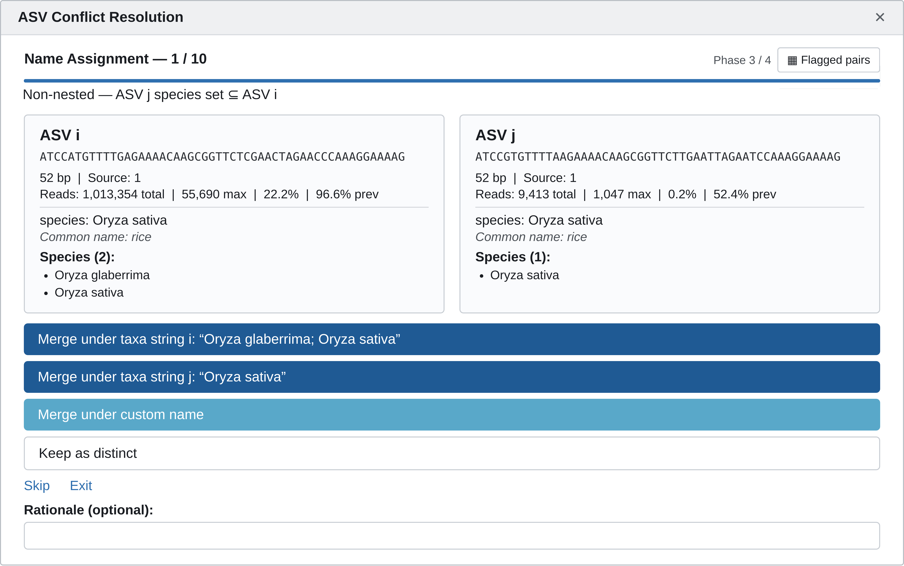

# Agglomerating Taxa

Agglomeration groups ASVs that represent the same organism — whether because they were sequenced at slightly different lengths, assigned at different taxonomic resolutions, or are simply redundant with one another — into a single representative taxon. This step happens after [pruning taxa](pruning.md) and before [calculating diversity](diversity.md), once taxa filtering, sample filtering, and pruning have already settled which ASVs and samples are in play. The approach differs by marker.

=== "trnL"

    trnL agglomeration works differently: rather than grouping by taxonomic rank alone, it detects ASVs that likely represent the same organism across (or within) sequencing batches — near-identical sequences, differing resolutions, overlapping or subset taxonomy — and merges them once a human has reviewed the ambiguous cases. Two functions handle this: **`plan_harmonization()`** and **`apply_harmonization()`**, both part of the `foodseq.tools` package. Install it if you haven't already, then load it:

    ``` r
    # install.packages("devtools")
    devtools::install_github("LAD-LAB/foodseq.tools")

    library(foodseq.tools)
    ```

    ### Prerequisite

    Both functions expect the `taxa` and `common_name` columns added by [`assign_common_names()`](commonnames.md#assign_common_names-function) to already be present in your phyloseq's tax table.

    ### Overview
    **Overview of the trnL harmonization workflow.** Purple shapes show the automated pairwise comparison, in which plan_harmonization() compares every pair of ASVs and sorts it into a scenario (S1–S5) based on sequence and taxonomy. Yellow boxes are the steps that require user input: reviewing each flagged pair and, optionally, choosing a representative ASV. Everything in green is automated, including flagging pairs for review, applying the accepted decisions with apply_harmonization(), and writing the decisions log and harmonized phyloseq object. 

    ``` mermaid
    flowchart TD
    
    ASVI["ASV i"]
    ASVJ["ASV j"]
    
    Q1{"Substring<br/>match?"}
    Q2{"Shared<br/>lineage?"}
    Q3{"Shared<br/><span style='font-family:ui-monospace,SFMono-Regular,Menlo,Consolas,monospace;font-size:85%;background:rgba(175,184,193,0.2);padding:0.2em 0.4em;border-radius:6px'>lowest_level</span>?"}
    Q4{"Shared<br/><span style='font-family:ui-monospace,SFMono-Regular,Menlo,Consolas,monospace;font-size:85%;background:rgba(175,184,193,0.2);padding:0.2em 0.4em;border-radius:6px'>taxa</span> set?"}
    Q5{"Shared<br/><span style='font-family:ui-monospace,SFMono-Regular,Menlo,Consolas,monospace;font-size:85%;background:rgba(175,184,193,0.2);padding:0.2em 0.4em;border-radius:6px'>taxa</span> set?"}
    Q6{"<span style='font-family:ui-monospace,SFMono-Regular,Menlo,Consolas,monospace;font-size:85%;background:rgba(175,184,193,0.2);padding:0.2em 0.4em;border-radius:6px'>taxa</span><br/>subset?"}
    Q7{"<span style='font-family:ui-monospace,SFMono-Regular,Menlo,Consolas,monospace;font-size:85%;background:rgba(175,184,193,0.2);padding:0.2em 0.4em;border-radius:6px'>taxa</span><br/>overlap?"}
    
    ASVI --> Q1
    ASVJ --> Q1
    
    Q1 -->|yes| Q2
    Q2 -->|yes| Q3
    Q3 -->|yes| Q4
    Q4 -->|yes| S1(("S1"))
    Q3 -.->|no| S2(("S2"))
    Q4 -.->|no| S1b(("S1b"))
    
    Q1 -.->|no| Q5
    Q5 -->|yes| S3(("S3"))
    Q5 -.->|no| Q6
    Q6 -->|yes| S4(("S4"))
    Q6 -.->|no| Q7
    Q7 -->|yes| S5(("S5"))
    
    FLAG["Flagged for<br/>manual review"]
    S2 --> FLAG
    S1b --> FLAG
    S3 --> FLAG
    S4 --> FLAG
    S5 --> FLAG
    
    REVIEW["<b>Interactive review</b><br/>Resolve each flagged pair:<br/>merge, keep separate, or override.<br/>Optionally pick a representative ASV<br/>and record a rationale."]
    REP["<b>Representative ASV selection</b> (optional)<br/>Default priority:<br/>1. Shortest sequence<br/>2. Lowest resolution<br/>3. Highest prevalence<br/>4. Highest read count"]
    APPLY["<b>Correction application</b><br/>Merges reads, aligns taxonomy,<br/>prunes redundant ASVs, and<br/>updates common names."]
    LOG[("Decisions log<br/>with rationale")]
    PS["Harmonized<br/>phyloseq object"]
    
    FLAG --> REVIEW
    S1 -->|not flagged| REP
    REVIEW --> REP
    REVIEW -.->|record decisions| LOG
    REP --> APPLY
    APPLY -->|apply accepted decisions| PS
    
    style FLAG fill:#C8E0C9,stroke:#2C5F2D,color:#1E3A1F
    style REVIEW fill:#F5EEDC,stroke:#C9A96E,color:#5F4A1E
    style REP fill:#C8E0C9,stroke:#2C5F2D,color:#1E3A1F
    style APPLY fill:#C8E0C9,stroke:#2C5F2D,color:#1E3A1F
    style PS fill:#CDE3CE,stroke:#2C5F2D,color:#1E5F1E
    style LOG fill:#CDE3CE,stroke:#2C5F2D,color:#1E5F1E
    ```

    ### **`plan_harmonization()`**

    Run:

    ``` r
    plan <- plan_harmonization(ps.trnL)
    ```

    at minimum to build a harmonization plan. The inputs of the function are:

    * `ps_list` (required) — a single phyloseq object, or a named list of phyloseq objects if you're harmonizing across multiple sequencing batches
    * `source_names` (optional) — batch labels, one per object in `ps_list`; by default `names(ps_list)`
    * `min_overlap` (optional) — the species-set overlap threshold for flagging non-substring pairs; by default `0.01`
    * `flag_common_name` (optional) — whether to also flag pairs that share a common name despite low species-set overlap; by default `FALSE`
    * `verbose` (optional) — whether to print a scenario summary to the console; by default `TRUE`
    * `tax_rank_cols` (optional) — character vector of formal taxonomic rank column names; inferred from the phyloseq's tax table when `NULL`
    * `save_path` (optional) — a file path to immediately write `$decisions` to as a CSV; by default `NULL` (not written)
    * `prior_decisions` (optional) — decisions from an earlier `plan_harmonization()` round on a related set of objects (its return value, `$decisions` directly, or a path to a saved CSV); by default `NULL`, meaning every pair is reviewed fresh. See "Reviewing incrementally across batches" below.

    Internally, `plan_harmonization()` relies on two helper functions: `compare_asvs()`, which does the actual pairwise ASV comparison (using its own internal helpers — `parse_species_set()`, `strip_infraspecific()`, and `taxa_set_relation()` — to parse and compare species sets), and `resolve_conflicts_interactive()`, the review gadget, which has its own internal helpers (e.g. `default_name()`, `do_merge_groups()`, `pair_info()`) for managing the review session's state.

    `plan_harmonization()` does its work in a few steps. First, it coerces a single phyloseq into a one-item list, since the rest of the function works over a list of batches:

    ``` r
    if (inherits(ps_list, "phyloseq")) ps_list <- list(ps_list)
    ```

    Next, it calls `compare_asvs()` to detect redundant ASV pairs. `compare_asvs()` compares every pair of ASVs both by sequence (is one a substring of the other?) and by taxonomy (do their species sets — from the `taxa` column — match, overlap, or conflict?), then classifies each pair into a scenario:

    | Scenario | Meaning | What happens |
    | --- | --- | --- |
    | S1 | Substring pair, identical species set | Auto-merged, keeping the shorter ASV |
    | S1b | Substring pair, same formal taxon, different species sets | Flagged for review |
    | S2 | Substring pair, different resolution, shared lineage | Flagged for review |
    | S3 | Non-substring pair, identical species sets | Flagged for review |
    | S4 | Non-substring pair, one species set a strict subset of the other | Flagged for review |
    | S5 | Non-substring pair, overlapping species sets (above `min_overlap`) | Flagged for review |
    | conflict | Conflicting taxonomy at the same rank | Flagged for review |
    | unassigned | One or both ASVs lack taxonomy | Flagged for review |

    Only S1 is resolved automatically; everything else needs a decision from you.

    If `prior_decisions` was supplied, it's checked next: a pair identical to an already-resolved row is carried forward automatically and never re-shown; a genuinely new pair that happens to touch an ASV `prior_decisions` already resolved is tagged `touches_prior_decision = TRUE` and reviewed as its own skippable category (reviewing one only ever decides whether the *new* ASV joins that established group, never anything about the group itself).

    Finally, it launches `resolve_conflicts_interactive()`, a Shiny gadget, so you can review every remaining flagged pair side by side and choose to merge, keep both distinct, or rename — then packages your decisions (along with the automatic S1 merges and anything carried forward from `prior_decisions`) into a `decisions` data frame:

    ``` r
    manual    <- resolve_conflicts_interactive(flagged = compare_result$flagged, compare_result = compare_result,
                                               prior_asv_final = prior_asv_final, exact_repeat_keys = exact_repeat_keys)
    decisions <- .build_decisions_table(compare_result$flagged, manual,
                                        prior_lookup = prior_lookup, prior_keep_asvs = prior_keep_asvs)
    ```

    Reviewing the gadget requires the `shiny`, `miniUI`, and `DT` packages to be installed, and an interactive R session (e.g. RStudio); run non-interactively (such as inside a knitted R Markdown document), it skips review and returns every pair unresolved with a warning.

    If you'd rather review the flagged pairs by hand instead of using the gadget, `plan$decisions` is a plain data frame you can edit directly — each row's `decision` column takes `"merge_keep_i"`, `"merge_keep_j"`, `"keep_distinct"`, or a literal ASV sequence (when both ASVs in a pair were merged into a third, external representative), left blank if still unresolved.

    #### Reviewing incrementally across batches

    If you harmonize new trnL batches on an ongoing basis rather than all at once, pass your previous round's plan back in as `prior_decisions`:

    ``` r
    plan2 <- plan_harmonization(ps_list2, prior_decisions = plan)
    ```

    This keeps a continuous project's decisions consistent over time and means each new round only asks you to review what's actually new, rather than re-showing every pair from scratch. `decisions` in the returned plan is always the full cumulative table (everything from `prior_decisions` plus whatever this round resolved) — ready to pass straight back in as `prior_decisions` again for the next round.

    #### Example Scenarios
    
    Deciding what to do with a flagged pair usually draws on two kinds of knowledge: **(1)** General knowledge of ASVs and markers, such as what trnL can resolve for a given genus or what a sequencing artifact typically looks like, tells you whether a pair is *likely* the same organism. **(2)** Cohort-specific factors, such as which species are plausible in your study population and whether merging would blur a distinction your research question needs, determine whether you'd *choose* to merge them. To support that judgment, the review gadget also shows read statistics for each ASV: total reads, the most reads in any single sample, percent of all reads, and prevalence (the percentage of samples it was detected in). A low-abundance, low-prevalence variant that closely resembles a common ASV is more likely to be an artifact, while two ASVs that are both abundant and widespread are more likely to be real, distinct sequences.
    
    Because these decisions are judgment calls, record the reasoning behind each one in the gadget's optional rationale field. Rationales are saved with each decision in the `decisions` table that `apply_harmonization()` returns, so anyone reproducing or reviewing the analysis can see not only which pairs were merged but why.

    Here's an example of what the interactive widget looks like:

    <figure markdown="span">
      { width="700" }
      <figcaption></figcaption>
    </figure>
    
    **S1 — substring pair, identical species sets → auto-merged**
    
    <pre class="asv-align"><code>asv_i (52 bp)  <b>-</b>ATCCGTGTTTTGAGAAAACAAGGGGTTCTCGAACTAGAATACAAAGGAAAAG
    asv_j (53 bp)  <b>A</b>ATCCGTGTTTTGAGAAAACAAGGGGTTCTCGAACTAGAATACAAAGGAAAAG</code></pre>
    
    |                   | `asv_i`                          | `asv_j`       |
    |-------------------|----------------------------------|---------------|
    | Deepest rank      | family (*Poaceae*)               | same          |
    | Matched taxa      | 20 *Triticum* and *Secale* species and subspecies (wheat/rye complex) | same |
    | Common name       | "wheat and rye"                  | same          |
    
    **What differs:** `asv_j` is `asv_i` with one extra base at the 5′ end, a typical sequencing or trimming artifact.
    
    **Merge or keep?** The two ASVs have identical assignments, so merging loses no information, and the pipeline merges them automatically, keeping the shorter sequence. You can still override any auto-merge in the review gadget.
    
    **S2 — substring pair, different resolution → flagged for review**
    
    <pre class="asv-align"><code>asv_i (51 bp)  ATCACGTTTTCCGAAAACAAACAAAGGTTCAGAAAGCGAAAAGAAAAAAAA<b>---</b>
    asv_j (54 bp)  ATCACGTTTTCCGAAAACAAACAAAGGTTCAGAAAGCGAAAAGAAAAAAAA<b>AAA</b></code></pre>
    
    |                   | `asv_i`                          | `asv_j`       |
    |-------------------|----------------------------------|---------------|
    | Deepest rank      | family (*Asteraceae*)            | species (*Matricaria chamomilla*) |
    | Matched taxa      | 12 taxa across 10 species: yarrow, wormwood, mugwort, tarragon, tansy, feverfew, Indian chrysanthemum, and German and Roman chamomile | *M. chamomilla* only |
    | Common name       | "tarragon, chamomile, yarrow, wormwood, mugwort, Indian chrysanthemum, and feverfew" | "chamomile" |
    
    **What differs:** `asv_j` has three more A's at the end of a poly-A run (11 instead of 8). At first glance this looks like the S1 artifact, but the two ASVs resolve to different identities, so the pair is not auto-merged. A difference in homopolymer length can be a sequencing artifact, but it can also be the variation that let `asv_j` resolve to chamomile, and the sequences alone can't tell you which.
    
    **Merge or keep?** Merging keeps the lower-resolution, family-level assignment, which is conservative but discards the species-level chamomile call. Keep them distinct if chamomile specifically matters to your question (for example, chamomile tea intake); merge if a broad Asteraceae herb/spice group is enough.
    
    **S3 — non-substring pair, identical species sets → flagged for review**
    
    <pre class="asv-align"><code>asv_i (39 bp)  ATC<b>A</b>T<b>G</b>GGTTACGCGAACAAACCAAAGTTTAGAAAGCGG
    asv_j (39 bp)  ATC<b>C</b>T<b>A</b>GGTTACGCGAACAAACCAAAGTTTAGAAAGCGG</code></pre>
    
    |                   | `asv_i`                          | `asv_j`       |
    |-------------------|----------------------------------|---------------|
    | Deepest rank      | variety (*Brassica oleracea* var. *italica*) | same |
    | Matched taxa      | *Brassica oleracea*              | same          |
    | Common name       | "cabbage, broccoli, cauliflower, etc." | same    |
    
    **What differs:** The two sequences are the same length and differ by two substitutions near the 5′ end, with no inserted or missing bases, so neither can be a substring of the other.
    
    **Merge or keep?** Both ASVs have the same assignment, so this is usually an easy merge. The case for keeping them apart would be that the two variants reflect real differences between *B. oleracea* crops, but trnL doesn't reliably separate cabbage, broccoli, and cauliflower, so that's rarely worth doing.
    
    **S4 — non-substring pair, one species set contained in the other → flagged for review**
    
    <pre class="asv-align"><code>asv_i (53 bp)  AATCC<b>A</b>TGTTTT<b>G</b>AGAAAACAAGCGGTTCT<b>C</b>GAA<b>C</b>TAGAA<b>C</b>CCAAAGGAAAAG
    asv_j (53 bp)  AATCC<b>G</b>TGTTTT<b>A</b>AGAAAACAAGCGGTTCT<b>T</b>GAA<b>T</b>TAGAA<b>T</b>CCAAAGGAAAAG</code></pre>
    
    |                   | `asv_i`                          | `asv_j`       |
    |-------------------|----------------------------------|---------------|
    | Deepest rank      | genus (*Oryza*)                  | species (*Oryza sativa*) |
    | Matched taxa      | *O. glaberrima*, *O. sativa*     | *O. sativa* only |
    | Common name       | "rice"                           | "rice"        |
    
    **What differs:** The two sequences are the same length but differ by five substitutions spread along their length, so this isn't a substring pair. `asv_j`'s species set is a strict subset of `asv_i`'s.
    
    **Merge or keep?** Both are "rice," and African rice (*O. glaberrima*) is less commonly eaten outside West Africa, so most studies would merge them. Keep them distinct if your cohort plausibly eats African rice or your question needs to tell the two rice species apart.
    
    **S5 — non-substring pair, overlapping species sets → flagged for review**
    
    <pre class="asv-align"><code>asv_i (48 bp)  <b>----</b>ATCCTGTTTTCTCAAAACAAAAGTTCAAAAAACGAAAAAAAAAAAAA<b>-</b>G
    asv_j (53 bp)  <b>CCAA</b>ATCCTGTTTTCTCAAAACAAAAGTTCAAAAAACGAAAAAAAAAAAAA<b>A</b>G</code></pre>
    
    |                   | `asv_i`                          | `asv_j`       |
    |-------------------|----------------------------------|---------------|
    | Deepest rank      | genus (*Ocimum*)                 | genus (*Ocimum*) |
    | Matched taxa      | *O. basilicum*, *O. × africanum* | *O. basilicum*, *O. gratissimum* |
    | Common name       | "basil"                          | "basil"       |
    
    **What differs:** `asv_j` is `asv_i` with four extra bases at the 5′ end and one extra A in the poly-A run near the 3′ end. That single extra A is the only reason this isn't caught as a substring pair. The species sets share *O. basilicum*, but each also includes a species the other lacks, which puts the pair in S5 rather than S3 or S4.
    
    **Merge or keep?** Both differences look like typical artifacts, and both ASVs are "basil," so merging is reasonable for most diet studies. Keep them distinct only if telling sweet basil apart from lemon basil (*O. × africanum*) or African basil (*O. gratissimum*) matters to your cohort or question.
    
    #### Understanding the Output

    `plan_harmonization()` returns a `harmonization_plan` object with two elements:

    * **`$decisions`** — a data frame with one row per flagged pair:
    * `scenario` / `action` — the classification (see the scenario table above)
    * both ASVs' sequences and taxonomy
    * `decision` / `chosen_name` / `rationale` — ready to hand-edit
    * `touches_prior_decision` — set when `prior_decisions` was supplied and this pair touches an ASV it already resolved
    * `plan_samples` / `plan_taxa_hashes` — manifest columns recording `ps_list`'s full original sample names and a compact hash of every original ASV, used by `apply_harmonization()`'s checkpoints below; not meant to be edited by hand
    * **`$summary`** — a table of pair counts by scenario

    ### **`apply_harmonization()`**

    Once decisions are made — via the gadget, or by hand-editing `plan$decisions` — `apply_harmonization()` applies them to your phyloseq:

    ``` r
    result  <- apply_harmonization(ps.trnL, plan)
    ps.trnL <- result$ps
    ```

    at minimum to apply the plan. The inputs of the function are:

    * `ps` (required) — the phyloseq object (or the merged result of your `ps_list`) that was passed to `plan_harmonization()`
    * `decisions` (required) — the list returned by `plan_harmonization()`, a decisions data frame (e.g. `plan$decisions`, possibly hand-edited), or a file path to a decisions table saved as a CSV
    * `tax_rank_cols` (optional) — character vector of formal taxonomic rank column names; inferred from `ps`'s tax table when `NULL`
    * `prior_outcomes` (optional) — a prior `apply_harmonization()` result (its return value, `$asv_outcomes` directly, or a path to a saved CSV) from an earlier round on a related object; by default `NULL`. See "Carrying an ASV ledger across rounds" below.

    Internally, `apply_harmonization()` relies on two helper functions: `.decisions_to_vectors()`, which validates and converts the `decisions` table's `decision` column into the `keep_asvs`/`manual_updates`/`rationale` vectors used below, and `resolve_final_keep()`, defined within the function itself, which walks a chain of merge decisions (e.g. A merged into B, itself merged into C) to find each ASV's ultimate surviving representative.

    It works in a few steps. If `decisions` carries the `plan_samples`/`plan_taxa_hashes` manifest columns `plan_harmonization()` wrote, `ps` is checked against them first — an ASV or sample in `ps` the plan never saw is reported. Neither check ever blocks execution; both only ever `warning()`/`message()`. Then it adds a `glom_name` column to the tax table, defaulting every ASV to its own sequence — so nothing merges unless a decision says so:

    ``` r
    taxtab$glom_name <- rownames(taxtab)
    ```

    For pairs where you chose to merge two ASVs at different taxonomic resolutions (scenario S2), it aligns the higher-resolution ASV's rank columns to match the lower-resolution one, so the surviving row is internally consistent:

    ``` r
    taxtab[to_rename, tax_rank_cols] <- taxtab[keep_asv, tax_rank_cols]
    ```

    It then applies any names you chose during review to `glom_name`, and transfers read counts from each discarded ASV to its merge target — resolving multi-hop chains first (e.g. A merged into B, which is itself merged into C) so no reads are lost regardless of processing order — before pruning the discarded ASVs:

    ``` r
    otu_mat[keep, ] <- otu_mat[keep, ] + otu_mat[discard, ]
    # ...
    otu_mat <- otu_mat[surviving, , drop = FALSE]
    ```

    Finally, it drops the temporary `glom_name` column and, if `prior_outcomes` was supplied, upserts this round's `asv_outcomes` rows onto the prior ones (this round wins for any ASV in both) and re-resolves every `merged_into` chain across the combined table.

    #### Carrying an ASV ledger across rounds

    `ps` physically loses an ASV the moment it's pruned, so on its own `$asv_outcomes` only ever reflects the most recent round's merges. To keep a running record across every round of harmonization you've done so far, pass the previous round's result back in as `prior_outcomes`:

    ``` r
    result2 <- apply_harmonization(ps.trnL2, plan2, prior_outcomes = result)
    ```

    This cumulative ledger is exactly what [PCA Projection](projection.md) uses as a stand-in reference object — see that page for why you might want one.

    #### Understanding the Output

    `apply_harmonization()` returns a list with:

    * **`ps`** — the corrected phyloseq
    * **`taxtab`** — its tax table as a data frame
    * **`asv_outcomes`** — the **ASV ledger**: one row per original ASV (as of `ps` at this call, plus anything carried forward via `prior_outcomes`), including:
        * `asv_status` — `"unchanged"` / `"representative"` / `"dropped after merge"` / `"unresolved"` (the last meaning this ASV is part of a still-blank flagged decision)
        * `merged_with` / `merged_into` — the latter always resolved to the ultimate surviving representative
        * the full rank-by-rank taxonomy (one column per `tax_rank_cols` entry — enough for this table alone to stand in for a live reference object)
        * `batch_source`, read counts, and rationale
    * **`unresolved`** — any flagged pairs still without a decision
    * **`n_s2_corrected`** — count of S2 rank-alignment corrections applied
    * **`n_manual`** — count of flagged pairs resolved

    Check `result$unresolved` for any flagged pairs that are still blank; if any remain, resolve them and re-run.

=== "12Sv5"

    12Sv5 agglomeration is a straightforward `tax_glom()` by `lowest_level` — the most specific non-`NA` taxonomic rank assigned to each ASV, already computed back in [Filtering Taxa](taxafiltering.md).

    ``` r
    ps.12S <- phyloseq::tax_glom(ps.12S, taxrank = "lowest_level")
    ```
