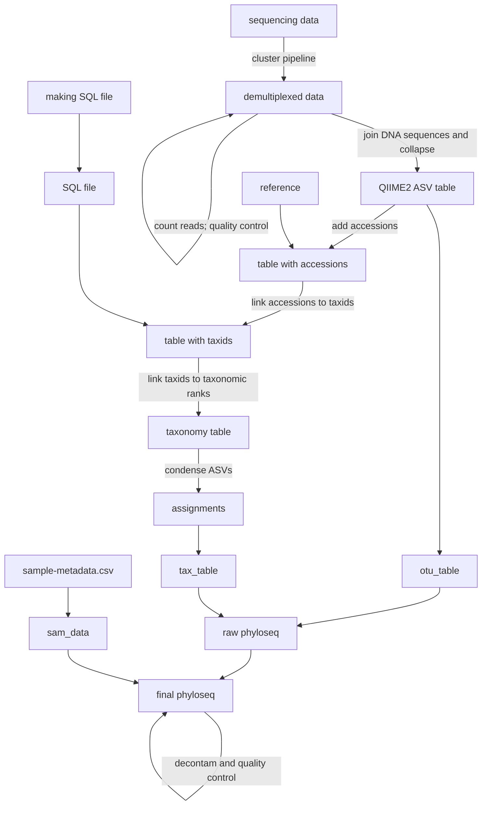

# Creating a Phyloseq (trnL and 12Sv5)

These instructions will help you create a phyloseq object from raw sequencing data. A [flowchart](/pipeline.html#flowchart) is provided at the bottom of the page if it may help simplify the workflow of the phyloseq creation process.

## In the Terminal

=== "Duke"

    ### Clone Repository to DCC

    First, clone the mb-pipelines repository from GitHub to the DCC to use `demux-barcodes.sh` and either `trnL-pipeline.sh` or `12SV5-pipeline.sh` in future steps. This step only needs to be done once; once you have the files on the DCC, you can skip this section.

    The scripts can be downloaded either to the group directory under your folder or to your home directory with the following shell code. If you are prompted for a password, follow [these instructions](https://docs.github.com/en/authentication/keeping-your-account-and-data-secure/managing-your-personal-access-tokens) to set up a personal access token.

    ``` sh
    # Log into the DCC:
    ssh [NetID]@dcc-login.oit.duke.edu

    # Navigate to where you want to clone the repository:
    cd /hpc/group/ldavidlab/users/[NetID]

    # Clone the respository:
    git clone https://github.com/LAD-LAB/mb-pipeline.git
    [GitHub username]
    [personal access token]
    ```

    ### Upload Sequencing Data to DCC

    Now, copy the sequencing data folder from Isilon to the DCC and upload a samplesheet containing the barcodes used during sequencing. In contrast to the above, these steps will need to be run every time.

    To copy the sequencing data folder from Isilon, first create a DCC folder for your project. Then, ensure you are connected to Isilon and run the following:

    ``` sh
    # Navigate to the sequencing folder on Isilon; change 2025 to the year of the sequencing run:
    cd /Volumes/All_Staff/Sequencing/Sequencing2025/

    # Copy sequencing data from Isilon to the DCC project folder:
    scp -r [sequencing data] [NetID]@dcc-login.oit.duke.edu:/hpc/group/ldavidlab/users/[NetID]/[path/to/project/folder]
    ```

    where `[sequencing data]` is in the form `XXXXXX_MNXXXXX_XXXX_XXXXXXXXXX`.

    To this project folder, also upload a samplesheet. A template is available on GitHub and should have been copied to your DCC folder; some lab members remove unnecessary barcodes by deleting their rows, while others recommend using the full template and pruning samples in the phyloseq itself later on. You may develop a preference yourself.

    ``` sh
    scp [/path/to/samplesheet.csv] [NetID]@dcc-login.oit.duke.edu:[/path/to/project/folder]
    ```

    You should now have the sequencing data and a samplesheet CSV in your project folder on the DCC.

    ### Demultiplex and Pipeline

    Now, run the `demux-barcodes.sh` script with the following:

    ``` sh
    # Log into the DCC:
    ssh [NetID]@dcc-login.oit.duke.edu

    # Submit a batch job to run demux-barcodes.sh:
    sbatch --mail-user=[NetID]@duke.edu [/path/to/demux-barcodes.sh] [/path/to/XXXXXX_MNXXXXX_XXXX_XXXXXXXXXX] [/path/to/samplesheet.csv] /hpc/group/ldavidlab/metabarcoding.sif
    ```

    Next, run the `trnL-pipeline.sh` or `12SV5-pipeline.sh` script, depending on the run:

    ``` sh
    # Submit a batch job to run trnL-pipeline.sh or 12SV5-pipeline.sh:
    sbatch --mail-user=[NetID]@duke.edu [/path/to/pipeline.sh] [/path/to/XXXXXXXX_results/demultiplexed] /hpc/group/ldavidlab/qiime2.sif
    ```

    Once this finishes, your file structure should look like

    ```
    └─[/DCC/path/to/]
      ├─ XXXXXX_MNXXXXX_XXXX_XXXXXXXXXX
      └─ XXXXXXXX_results
         ├─ XXXXXXXX_sequencing_output #either XXXXXXXX_trnL_output or XXXXXXXX_12SV5_output
         ├─ demultiplexed
         │  └─ [demultiplexed .fastq.gz files]
         └─ Reports
            ├─ demux-barcodes-[jobid].err
            └─ demux-barcodes-[jobid].out
    ```

    If everything looks good, you can proceed to RStudio to run `Pipeline-to-phyloseq.Rmd`.

=== "General"

    ### Clone Repository to HPC

    First, clone the mb-pipelines repository from GitHub to your computing cluster to use `demux-barcodes.sh` and either `trnL-pipeline.sh` or `12SV5-pipeline.sh` in future steps. This step only needs to be done once; once you have the files on the cluster, you can skip this section.

    The scripts can be downloaded to your directory with the following shell code. If you are prompted for a password, follow [these instructions](https://docs.github.com/en/authentication/keeping-your-account-and-data-secure/managing-your-personal-access-tokens) to set up a personal access token.

    ``` sh
    # Log into your cluster:
    ssh [username]@[hpc-hostname]

    # Navigate to where you want to clone the repository:
    cd [/hpc/path/to/lab/directory]/users/[username]

    # Clone the respository:
    git clone https://github.com/LAD-LAB/mb-pipeline.git
    [GitHub username]
    [personal access token]
    ```

    ### Upload Sequencing Data to HPC

    Now, copy the sequencing data folder from your shared storage to the cluster and upload a samplesheet containing the barcodes used during sequencing. In contrast to the above, these steps will need to be run every time.

    First, create a cluster folder for your project. Then, ensure you are connected to your shared storage and run the following:

    ``` sh
    # Navigate to the sequencing folder on your shared storage:
    cd [/path/to/shared/storage/Sequencing/]

    # Copy sequencing data to the cluster project folder:
    scp -r [sequencing data] [username]@[hpc-hostname]:[/hpc/path/to/lab/directory]/users/[username]/[path/to/project/folder]
    ```

    where `[sequencing data]` is in the form `XXXXXX_MNXXXXX_XXXX_XXXXXXXXXX`.

    To this project folder, also upload a samplesheet. A template is available on GitHub and should have been copied to your cluster folder; some lab members remove unnecessary barcodes by deleting their rows, while others recommend using the full template and pruning samples in the phyloseq itself later on. You may develop a preference yourself.

    ``` sh
    scp [/path/to/samplesheet.csv] [username]@[hpc-hostname]:[/path/to/project/folder]
    ```

    You should now have the sequencing data and a samplesheet CSV in your project folder on the cluster.

    ### Demultiplex and Pipeline

    Now, run the `demux-barcodes.sh` script with the following:

    ``` sh
    # Log into your cluster:
    ssh [username]@[hpc-hostname]

    # Submit a batch job to run demux-barcodes.sh:
    sbatch --mail-user=[username]@[your-email] [/path/to/demux-barcodes.sh] [/path/to/XXXXXX_MNXXXXX_XXXX_XXXXXXXXXX] [/path/to/samplesheet.csv] [/path/to/metabarcoding.sif]
    ```

    Next, run the `trnL-pipeline.sh` or `12SV5-pipeline.sh` script, depending on the run:

    ``` sh
    # Submit a batch job to run trnL-pipeline.sh or 12SV5-pipeline.sh:
    sbatch --mail-user=[username]@[your-email] [/path/to/pipeline.sh] [/path/to/XXXXXXXX_results/demultiplexed] [/path/to/qiime2.sif]
    ```

    Once this finishes, your file structure should look like

    ```
    └─[/hpc/path/to/]
      ├─ XXXXXX_MNXXXXX_XXXX_XXXXXXXXXX
      └─ XXXXXXXX_results
         ├─ XXXXXXXX_sequencing_output #either XXXXXXXX_trnL_output or XXXXXXXX_12SV5_output
         ├─ demultiplexed
         │  └─ [demultiplexed .fastq.gz files]
         └─ Reports
            ├─ demux-barcodes-[jobid].err
            └─ demux-barcodes-[jobid].out
    ```

    If everything looks good, you can proceed to RStudio to run `Pipeline-to-phyloseq.Rmd`.

## In R
### Download Data to R

=== "Duke"

    Create a Box folder for your project and download or duplicate a copy of `Pipeline-to-phyloseq.Rmd` to it. You can directly do this from GitHub or through the following code:

    ``` sh
    # Navigate to your Box project folder:
    cd [/Box/path/to/project/folder]

    # Download Pipeline-to-phyloseq.Rmd from GitHub:
    wget https://raw.githubusercontent.com/LAD-LAB/mb-pipeline/main/pipeline/Pipeline-to-phyloseq.Rmd
    ```

=== "General"

    Create a project folder and download or duplicate a copy of `Pipeline-to-phyloseq.Rmd` to it. You can directly do this from GitHub or through the following code:

    ``` sh
    # Navigate to your project folder:
    cd [/path/to/project/folder]

    # Download Pipeline-to-phyloseq.Rmd from GitHub:
    wget https://raw.githubusercontent.com/LAD-LAB/mb-pipeline/main/pipeline/Pipeline-to-phyloseq.Rmd
    ```

??? bug "Troubleshooting"

    If you are using a Mac and are getting the error `zsh: command not found: #` due to the comments in this example code, you can update your .zshrc file to allow for bash-style comments. To do so, first open your .zshrc file by going to your Mac's Home directory and pressing  <kbd>Cmd</kbd> + <kbd>Shift</kbd> + <kbd>.</kbd>  to display hidden folders and files, including your .zshrc file.

    With the file open, scroll to the bottom and paste `setopt interactivecomments`. Save your .zshrc file and comments should now not trigger errors in Terminal.

Now we will walk through `Pipeline-to-phyloseq.Rmd`. First, load the necessary packages and functions. If you do not have a package installed, install it first with the function `install.packages("[package name]")`.

``` r
library(here) # For relative paths
library(MButils)
library(phyloseq)
library(devtools)
library(qiime2R)
library(tidyverse)
library(taxonomizr)
library(decontam) # for detecting contaminants

join_table_seqs <- function(feature_table, sequence_hash){
     # feature_table and sequence_hash are the result of reading in QIIME2
     # artifacts with QIIME2R
     
     # Make dataframe mapping from from hash to ASV
     sequence_hash <- 
          data.frame(asv = sequence_hash$data) %>% 
          rownames_to_column(var = 'hash')
     
     # Substitute hash for ASV in feature table
     feature_table <-
          feature_table$data %>% 
          data.frame() %>% 
          rownames_to_column(var = 'hash') %>% 
          left_join(sequence_hash) %>% 
          column_to_rownames(var = 'asv') %>% 
          dplyr::select(-hash) 
     
     # Transform rows and columns and repair plate-well names\
     feature_table <- t(feature_table) 
     
     # Repair names
     row.names(feature_table) <- gsub(pattern = 'X',
                                      replacement = '',
                                      row.names(feature_table))
     row.names(feature_table) <- gsub(pattern = '\\.',
                                      replacement = '-',
                                      row.names(feature_table))
          
     feature_table
}
```

Next, download data from the cluster to your project folder:

=== "Duke"

    ``` sh
    scp -r [NetID]@dcc-login.oit.duke.edu:[/DCC/path/to/XXXXXXXX_results/XXXXXXXX_sequencing_output] [/Box/path/to/project/folder]
    ```

=== "General"

    ``` sh
    scp -r [username]@[hpc-hostname]:[/hpc/path/to/XXXXXXXX_results/XXXXXXXX_sequencing_output] [/path/to/project/folder]
    ```

### Extract Read Counts

Set the folder with your sequencing output as `qiime.dir`:

``` r
qiime.dir <- '[/path/to/Box/project/folder/XXXXXXXX_sequencing_output]'

# Point to directory containing pipeline output
# Set variables for bash
Sys.setenv(QIIME_DIR = qiime.dir)
```

Next, count reads. The first chunk extracts relevant data from the QIIME2 files, while the second chunk writes a CSV containing the number of reads for each sample at each processing step to be used for quality control. The first chunk should only be run once; if it fails, delete the files and start over.

``` sh
# Extract count information from QIIME2 visualization object
# Unzip the files if not already done
cd "$QIIME_DIR"

for f in [123]*.qzv; do
     unzip $f -d ${f%.qzv}
done
unzip 4_denoised-stats.qzv -d 4_denoised-stats
```

``` r
# Read TSVs
count.fs <- 
     list.files(qiime.dir,
                pattern = 'per-sample-fastq-counts.tsv|metadata.tsv',
                recursive = TRUE,
                full.names = TRUE)
test=count.fs[1]
split_result=unlist(str_split(test,"/"))

count.files=c(seq_along(count.fs))
for (i in seq_along(count.fs)) {
  f=count.fs[i]
  split_result=unlist(str_split(f,"/")) # unzipped qiime directories go /name-of-qzv/random-numbers/data/file.tsv
  dirName=split_result[length(split_result) - 3] # so I can access what step of the pipeline the file came from by going back 3
  f=read_delim(f)
  if (dirName=='4_denoised-table') {
    break # this directory shouldn't have been unzipped but in case it was, skip it 
  }
  if (dirName=='4_denoised-stats') {
    f=f[-1,] %>%
      mutate(sample_ID=`sample-id`) %>%
      dplyr::select(sample_ID,filtered,denoised,merged,`non-chimeric`) 
    
  } 
  else {
  colnames(f)=str_replace_all(colnames(f),fixed(" "),"_")
  f$reverse_sequence_count=NULL
  colnames(f)[2]=dirName }
  if (i==1) {
    count.files=f
  } else {
    count.files=left_join(count.files,f,by='sample_ID')
  }
}
count.files
names(count.files) <- c('sample', 
                         'raw',
                         'adapter_trim',
                         'primer_trim',
                        'filtered',
                        'denoised',
                        'merged',
                        'non_chimeric')
count.files
write.csv(count.files,file.path(qiime.dir,
                                'track-pipeline.csv'))
```

Now, we read the CSV back in and plot reads for quality control.

``` r
count.files=file.path(qiime.dir,
                      'track-pipeline.csv') %>%
  read.csv()
```

``` r
count.files %>%
  pivot_longer(names_to = 'step',values_to = 'count',cols=c('raw',
                         'adapter_trim',
                         'primer_trim',
                        'filtered',
                        'denoised',
                        'merged',
                        'non_chimeric')) %>%
  mutate(label=ifelse(sample=='Undetermined','Undetermined','Sample'),
         step=factor(step,levels=c('raw',
                         'adapter_trim',
                         'primer_trim',
                        'filtered',
                        'denoised',
                        'merged',
                        'non_chimeric'))) %>%
  ggplot(aes(x = step, 
                       y = count, 
                       by = sample, 
                       group = sample)) +
     geom_line(alpha = 0.5) +
     facet_wrap(~label, 
                scales = 'free_y') +
     labs(x = 'Pipeline step', 
          y = 'Reads', 
          title = '[DATE] MiniSeq run') +
     theme_bw() +
     theme(axis.text.x = element_text(angle = 45, hjust = 1))
setwd(qiime.dir)
ggsave('QC_track-reads-plot.png')
```

The output should look like `[what?]`. `[Image]`

### Data Preparation and Quality Control

These next three chunks prepare the QIIME2 output so that the table is organized as samples by features instead of features by samples, and so that ASVs are represented with DNA sequences instead of hash codes:

``` r
qiime.asvtab <- 
     file.path(qiime.dir,
          '4_denoised-table.qza') %>% 
     read_qza()
```

``` r
qiime.seqs <- 
     file.path(qiime.dir,
          '4_denoised-seqs.qza') %>% 
     read_qza()
```

``` r
qiime.asvtab <- join_table_seqs(qiime.asvtab, qiime.seqs)
```

Next, collapse subsequences into their larger sequences with the `dada2` package:

``` r
cat(ncol(qiime.asvtab), 'ASVs before collapsing\n')
qiime.asvtab <- dada2::collapseNoMismatch(qiime.asvtab)
cat(ncol(qiime.asvtab), 'ASVs after collapsing\n')
```

For quality control, we next create a histogram of sequence lengths:

``` r
lengths <- 
     data.frame(asv = colnames(qiime.asvtab),
                reads = colSums(qiime.asvtab)) |> 
     mutate(length = nchar(asv))

# Histogram of sequence lengths
ggplot(lengths, aes(x = length)) +
     geom_histogram(binwidth = 5, boundary = 0) +
     geom_vline(xintercept = c(10, 143), # Reported range of trnL length
                color = 'red', 
                linetype = 'dashed') +
     labs(x = 'ASV length (bp)', y = 'Count') +
     theme_bw() +
     scale_x_continuous(minor_breaks = seq(0, 250, 10), 
                        breaks = seq(0, 250, 50))
setwd(qiime.dir)
ggsave('QC_seq-lengths-histogram.png')
```

### Create the Taxonomy Table

Read in the reference:

=== "Duke"

    ``` r
    ref <- '[/path/to/Box]/project_davidlab/LAD_LAB_Personnel/Ashish_S/References/[reference]'
    ```

=== "General"

    ``` r
    ref <- '[/path/to/reference]'
    ```

Using the reference, assign species-level taxonomy to each ASV. Then, separate the accession from the species name:

``` r
# Using modified assignSpecies function from DADA2
# (only modifies format of returned data, not underlying assignment)
taxtab.species <- MButils::assignSpecies_mod(qiime.asvtab, 
                                             refFasta = ref, 
                                             tryRC = TRUE)

```

``` r
# Separate accession from species name in our current list of assignments
taxtab.species.sep <- separate(taxtab.species, 
                           Species,
                           into = c('accession', 'taxon'),
                           sep = ' ',
                           extra = 'merge')

head(taxtab.species.sep)
```

For quality control, check how many ASVs were unassigned by this step:

``` r
# How many ASVs unassigned?
unassigned <- taxtab.species.sep$asv[is.na(taxtab.species$Species)]

# Percentage of sequence variants
cat(100*(1 - (length(unassigned)/dim(qiime.asvtab)[2])), '% ASVs have an assigment\n')

# Percentage of reads mapping to these unassigned species
cat('These ASVs cover', 100*(1-sum(qiime.asvtab[, unassigned])/sum(qiime.asvtab)), '% of sequence reads in the dataset')
```

Next, read in the SQL file (see [Creating the SQL File](sql.md) for more information) and use it to link the accession numbers to taxids:

=== "Duke"

    Make sure you are connected to Isilon:

    ``` r
    sql <- '/Volumes/All_Staff/localreference/ncbi_taxonomy/accessionTaxa.sql'
    ```

=== "General"

    ``` r
    sql <- '[/path/to/accessionTaxa.sql]'
    ```

``` r
# Now look up full taxonomy
# First link accession to taxon ID
taxids <- 
     taxonomizr::accessionToTaxa(taxtab.species.sep$accession,
                                 sql)

# Manually adding in Solanum lycopersicum (taxid 4081, accession AC_000188.1)
if (any(taxtab.species.sep$accession == "AC_000188.1")) {
  taxids[which(taxtab.species.sep$accession == "AC_000188.1")] <- 4081
}

# Manually adding in Sideroxylon spinosum (taxid 2945705, accession DQ924307.1)
if (any(taxtab.species.sep$accession == "DQ924307.1")) {
  taxids[which(taxtab.species.sep$accession == "DQ924307.1")] <- 2945705
}

taxids
```

Use the taxids to get the full taxonomic lineage of each species with the `taxonomizr` package and select the desired ranks. Then, build the taxonomy table:

``` r
# Then link taxon ID to full taxonomy
taxonomy.raw <- 
     taxonomizr::getRawTaxonomy(taxids, sql)
```

``` r
# Pull desired levels from this structure
# Not working within getTaxonomy function
vars <- c("superkingdom", 
          "phylum", 
          "class", 
          "order", 
          "family", 
          "genus",
          "species",
          "subspecies",
          "varietas",
          "forma")

taxonomy <- data.frame(superkingdom = NULL,
                       phylum = NULL,
                       class = NULL,
                       order = NULL,
                       family = NULL,
                       genus = NULL,
                       species = NULL,
                       subspecies = NULL,
                       varietas = NULL,
                       forma = NULL)

# Define an empty row to be returned if no accession was looked up
empty <- rep(NA, 10)
names(empty) <- vars

acc <- function(i, taxonomy.raw, vars) {
     # If accession looked up, pull relevant columns and return it
     row.i <- 
          taxonomy.raw[[i]] %>% 
          t() %>% 
          data.frame() 
     
     # Pick columns we're interested in
     shared <- intersect(vars, names(row.i))
     row.i <- select(row.i, one_of(shared))
     row.i
}

# If not looked up, returne empty row
no_acc <- function() empty

for (i in seq_along(taxonomy.raw)){
     row.i <- 
          tryCatch(
               {
                    acc(i, taxonomy.raw, vars)
               }, 
               error = function(e) {
                    no_acc()
               }
          )

     taxonomy <- bind_rows(taxonomy, row.i)
}
```

``` r
head(taxonomy)
```

Group ASVs by their most recent common ancestor and do a quality check to determine the rank to which assignments are made after merging:

``` r
# Group these to their last common ancestor using taxonomizr's condenseTaxa function
ncol(qiime.asvtab)
assignments <- 
     taxonomizr::condenseTaxa(taxonomy,
                              groupings = taxtab.species$asv)
dim(assignments)
```

``` r
# To what label are assignments made?
colSums(!is.na(assignments))/nrow(assignments)
```

### Create the Phyloseq

The following code creates a raw phyloseq with a `tax_table` and an `otu_table` as created above: 

``` r
ps <- 
     phyloseq(otu_table = otu_table(qiime.asvtab,
                                    taxa_are_rows = FALSE),
              tax_table = tax_table(assignments))

ps
```

``` r
setwd(qiime.dir)
ps %>%
  saveRDS(file='raw-ps.rds')
```

``` r
setwd(qiime.dir)
ps =readRDS('raw-ps.rds')
```

??? bug "Troubleshooting"

    If you are having trouble creating the phyloseq object from `qiime.asvtab` and `assignments`, it may help to ensure they are structured correctly. `qiime.asvtab` should be a matrix where rows represent samples and columns represent ASVs (DNA sequences), while `assignments` should be a matrix where rows represent ASVs corresponding to the columns in `qiime.asvtab` and columns represent taxonomic ranks. Verify this with:
    ``` r
    str(qiime.asvtab)       
    head(qiime.asvtab)      
    str(assignments)        
    head(assignments)       
    ```
    If either is a dataframe, convert that object to a matrix with the `as.matrix()` function.

    Another source of error may be that the `phyloseq` package is not loaded properly. To load it, run:
    ``` r
    install.packages("phyloseq")
    library(phyloseq)
    ```

    Also check that the ASVs of `qiime.asvtab` and `assignments` are identical by running:
    ``` r
    identical(colnames(qiime.asvtab), rownames(assignments))
    ```
    This should return `TRUE`; if it does not, the error is likely caused further upstream and you should determine why this discrepancy exists.

### Add Metadata

Read in metadata from a CSV saved to your project folder. It should have a column `Sample_ID` with entries that match to the existing sample names from `samplesheet.csv` (in the form `1-A01`); a column `type` whose values are 'sample,' 'positive control,' 'negative control,' or 'blank;' and a column `pcr_plate` whose value is the plate number from the sequencing run. For decontamination steps, the column `qubit` is also needed with quantification data:

``` r
setwd(qiime.dir)
samdf='sample-metadata.csv' %>%  # or whatever you have your metadata file named
read.csv() # a .csv file where "Sample_ID" is the same as in the samplesheet.csv file. You may need to change the path:
# samdf=read.csv('/path/to/sample-metadata.csv')

row.names(samdf)=samdf$Sample_ID
sample_data(ps)=samdf
```

``` r
setwd(qiime.dir)
ps %>%
  saveRDS(file='ps-wMetadata.rds')
```

``` r
setwd(qiime.dir)
ps='ps-wMetadata.rds' %>%
  readRDS()
```

### Quality Control

Now for some quality control steps. The following code will specifically look at controls (samples not labelled `sample`) and plot the abundance of different ASVs in the samples for each type of control: 

``` r
ps.controls <-
     ps %>% 
     subset_samples(!type%in%c('sample')) %>% 
     prune_taxa(taxa_sums(.) > 0, .)
ps.controls

taxtab.controls <- tax_table(ps.controls)@.Data
taxtab.controls=data.frame(taxtab.controls) %>% 
   mutate(label=ifelse(!is.na(species),species, # setting "name" to the lowest taxonomic level that was assigned 
                     ifelse(!is.na(genus),genus, # there is probably a much more elegant way to do this but oh well
                            ifelse(!is.na(family),family,
                                   ifelse(!is.na(order),order,phylum)))))

# Replace in object
tax_table(ps.controls) <- as.matrix(taxtab.controls)
taxtab.controls
p=ps.controls %>% 
     psmelt() %>% 
     ggplot(aes(x = Sample, y = Abundance, fill = label)) +
     geom_bar(stat = "identity", position = "stack") + 
     facet_wrap(~type, scales = 'free') +
     labs(x = 'Control', y = 'Number of reads', fill = 'ASV identity',
     title = 'SAGE 14-28mo lib2 12SV5') +
     theme_bw()
print(p)
setwd(qiime.dir)
ggsave(plot=p,filename='QC_controls.png')
```

Now, let's look at where positive control species are detected. The example below is *Trifolium pratense* or the red clover, the trnL positive control; the following code will detect non-positive control samples where *Trifolium pratense* is detected and map them onto a plate map:

``` r
# put species used in controls here. 
control.species='Trifolium pratense' # red clover
```

``` r
ps %>%
  psmelt() %>%
  subset(species==control.species & Abundance>0 & type!='positive control') %>%
    ggplot(aes(x=Sample,y=Abundance,fill=species)) + geom_bar(stat='identity') + facet_wrap(~type,scales='free') + ggtitle("Wells where positive control species was detected")
setwd(qiime.dir)
ggsave("QC_Pos.Control-Detections.png")
```

The following code helps determine the degree to which samples in which positive controls are detected are dominated by reads of those positive controls, which may help estimate if the positive control is truly present in the sample or not:

``` r
yesControl=ps %>%
  psmelt() %>%
  group_by(Sample) %>%
  subset(species==control.species) %>%
  summarise(yesControl=ifelse(Abundance>0,'Yes','No')) %>%
  distinct() %>%
  subset(yesControl=='Yes') %>%
  .$Sample
ps %>%
  psmelt() %>%
  subset(Sample%in%yesControl & type%in%c('sample','Sample')) %>%
    ggplot(aes(x=Sample,y=Abundance,fill=species)) + geom_bar(stat='identity') + facet_wrap(~Sample,scales='free',nrow=1) + ggtitle("Samples where positive control species was detected") + theme(legend.position = 'bottom')

setwd(qiime.dir)
ggsave('QC_Pos.Control-Detections_SamplesOnly.png')
```

``` r
# install ggplate
# devtools::install_github("jpquast/ggplate")
library(ggplate)

contam.plot=ps %>%
  psmelt() %>%
  group_by(Sample) %>%
  subset(species==control.species) %>%
  summarise(reads=as.numeric(Abundance),
            yesControl=ifelse(Abundance>0,'+',''),
            type=type) %>%
  distinct() %>%
  separate(col=Sample,into=c('plate','well'),sep='-',remove=FALSE)

for (Plate in unique(contam.plot$plate)) { # generate a plot for each plate
p=contam.plot %>%
    subset(plate==Plate) %>%
  plate_plot(
    position = well,
    label=yesControl,
    limits=c(1,2), # if this is left empty then there is an error
  value = type,
  plate_size = 96,
  plate_type = "round",
  colour = c(
    "#51127CFF",
    "#B63679FF",
    "#FB8861FF"
  ),
  title=paste('Barcode Plate',Plate)
) 
print(p)
setwd(qiime.dir)
ggsave(plot=p,filename=paste0('QC_Pos.ControlMap_Plate',Plate,'.png'))
}
```

???+ note
    This code assumes that samples plates correspond to barcode plates (e.g. it assumes that two samples on barcode plate 2 were sequenced on the same plate), which is not always true.

### Decontamination

The following chunks determine where contaminants are located:

``` r
# Remove samples with 0 reads  (need this for subsequent plotting)
sample_data(ps)$reads <- sample_sums(ps)
ps.nonzero <- subset_samples(ps, reads > 0)
ps.nonzero
samdf=ps@sam_data%>%
  data.frame()
```

``` r
# Flag negative controls
sample_data(ps.nonzero)$is_neg <- 
     sample_data(ps.nonzero)$type == 'negative control'

# Troubleshooting: qubit data needs to have a particular format

# for negative qubit data
# sample_data(ps.nonzero)$qubit[sample_data(ps.nonzero)$qubit<0]<-0.000000000001 # set negative qubit values to pseudocount

# for missing qubit data
# sample_data(ps.nonzero)$qubit[is.na(sample_data(ps.nonzero)$qubit)]<-0.000000000001 # set NA to pseudocount --careful, this will also add a pseudocount if you forgot to add qubit data
# Identify contaminants
contamdf <- isContaminant(ps.nonzero, 
                          conc = 'qubit', 
                          neg = 'is_neg',
                          batch = 'pcr_plate',
                          method = 'combined')

contamdf
```

``` r
contam.asvs <- 
     filter(contamdf, contaminant == TRUE) %>% 
     row.names()

taxtab <- ps.nonzero@tax_table@.Data
if (length(contam.asvs)==1) {
taxtab.contam=data.frame(t(taxtab[contam.asvs, ])) %>%
mutate(name=ifelse(!is.na(species),species, 
                     ifelse(!is.na(genus),genus, 
                            ifelse(!is.na(family),family,
                                   ifelse(!is.na(order),order,phylum))))) 
taxtab.contam$name=make.unique(taxtab.contam$name)
print('The following contaminants were detected:')
print(taxtab.contam$name)
  
} 
if (length(contam.asvs)>1) { 
  print(paste(length(contam.asvs),'contaminants detected'))
taxtab.contam=data.frame(taxtab[contam.asvs, ]) %>%
mutate(name=ifelse(!is.na(species),species, 
                     ifelse(!is.na(genus),genus, 
                            ifelse(!is.na(family),family,
                                   ifelse(!is.na(order),order,phylum))))) 
taxtab.contam$name=make.unique(taxtab.contam$name)
print('The following contaminants were detected:')
print(taxtab.contam$name)
} 
if (length(contam.asvs)==0){
  print('No contaminating ASVs detected')
}
```

``` r
contam.plot=ps %>%
  psmelt() %>%
  subset(OTU%in%contam.asvs) %>%
  mutate(name=species) %>%
  group_by(Sample,OTU) %>%
  summarise(reads=as.numeric(Abundance),
            yesContam=ifelse(Abundance>0,'+',''),
            type=type,
            name=name) %>%
  distinct() %>%
  separate(col=Sample,into=c('plate','well'),sep='-',remove=FALSE)

contam.plot
for (contaminant in unique(contam.plot$OTU)) { 
for (Plate in unique(contam.plot$plate)) { # generate a plot for each plate
  name=contam.plot$name[contam.plot$OTU==contaminant][1]
  name
p=contam.plot %>%
    subset(plate==Plate & OTU==contaminant) %>%
  plate_plot(
    position = well,
    label=yesContam,
    limits=c(1,2), # if this is left empty then there is an error
  value = type,
  plate_size = 96,
  plate_type = "round",
  colour = c(
    "#51127CFF",
    "#B63679FF",
    "#FB8861FF"
  ),
  title=paste('Contaminant:', name,'\nBarcode Plate',Plate)
  
) 
print(p)
setwd(qiime.dir)
ggsave(plot=p,filename=paste0('QC_Contaminant-',gsub(' ','-',name),'_Plate',Plate,'.png'))
} 
}
```

### Save the Finished Phyloseq

If you would like to remove contaminants, run the next code chunk to save your finished phyloseq; if you choose not to remove contaminants, run the following code chunk instead:

!!! warning
    The following code completely removes the ASVs identified as contaminants from the entire phyloseq object, even if those ASVs were truly detected in some samples. Only run this chunk if your downstream analysis is sensitive to the detected contamination.

``` r
setwd(qiime.dir)
ps.decontam.nocontrols <- 
     prune_taxa(!(taxa_names(ps)%in%contam.asvs), ps) %>%
  subset_samples(., type == 'sample') %>% 
     prune_taxa(taxa_sums(.) > 0, .)
ps.decontam.nocontrols %>%
  saveRDS(file='NoControls-decontam-ps.rds')
```

Run this code chunk to save your finished phyloseq if you have chosen *not* to remove contaminants:

``` r

setwd(qiime.dir)
# Can now completely drop controls from object
ps <- 
     subset_samples(ps, type == 'sample') %>% 
     prune_taxa(taxa_sums(.) > 0, .)
ps %>%
  saveRDS(file='NoControls-ps.rds')
```

The finished phyloseq should be saved to your project folder for further analysis.

***

## Flowchart

