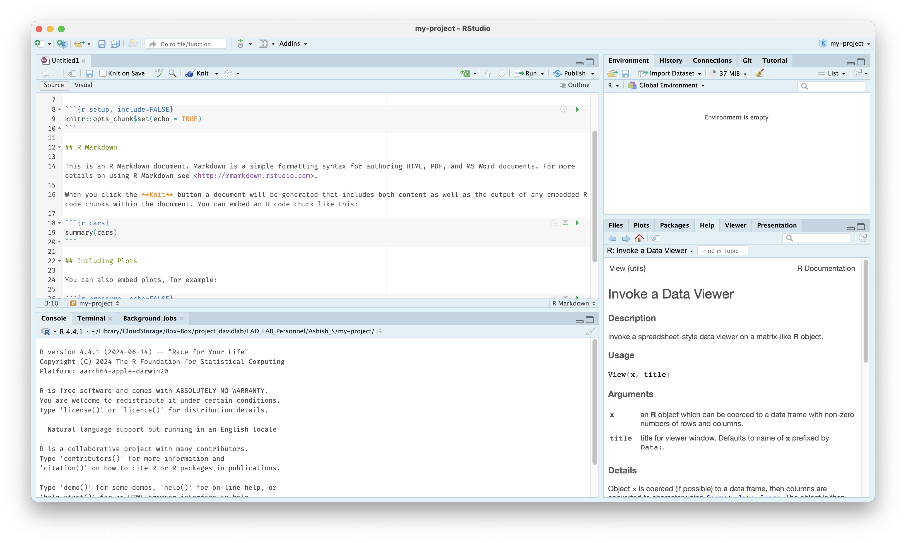

# Setting Up

This page is intended to help you set up and familiarize yourself with the lab's biostatistics essentials, such as GitHub, the Duke Compute Cluster, and Isilon.

## Duke Compute Cluster

The Duke Compute Cluster (DCC) is a high-performance computing cluster, a group of large and powerful servers (nodes) connected by a high-speed network that is able to handle massive amounts of data at high speeds. The DCC uses Slurm for cluster management and job scheduling. For further information, visit [https://oit-rc.pages.oit.duke.edu/rcsupportdocs/](https://oit-rc.pages.oit.duke.edu/rcsupportdocs/).

The DCC has two directories, `/hpc/home` and `/hpc/group`; as the former has limited storage, much of our work with the DCC is done in the latter, particularly within `/hpc/group/ldavidlab`. Create a folder for yourself at `/hpc/group/ldavidlab/users/[NetID]`.

### Logging In

To use the Duke Compute Cluster, open the terminal and log in with `ssh [NetID]@dcc-login.oit.duke.edu`. This will require multi-factor authentication. Here is an example of what this should look like:

``` sh
(base) ams292@MGM-C6LXGRQV ~ % ssh ams292@dcc-login.oit.duke.edu
(ams292@dcc-login.oit.duke.edu) Password: 
(ams292@dcc-login.oit.duke.edu) Duo two-factor login for ams292

Enter a passcode or select one of the following options:

 1. Duo Push to XXX-XXX-0389
 2. Duo Push to ipad (iOS)
 3. Phone call to XXX-XXX-0389
 4. SMS passcodes to XXX-XXX-0389

Passcode or option (1-4): 1
Success. Logging you in...
Success. Logging you in...
Last login: Tue Oct  1 10:26:19 2024 from 152.16.191.138
################################################################################
# Please report any issues or questions to: oitresearchsupport@duke.edu        #
#                                                                              #
# Duke Research Computing info and documentation: https://rc.duke.edu          #
#                                                                              #
# My next patch run is Wednesday (10-02-2024) at  7 PM                         #
################################################################################
ams292@dcc-login-04  ~ $ 
```

### SSH Keys

You can set up ssh keys as a secure workaround to using your password with multi-factor authentication. To generate a key pair, first run:

``` sh
ssh-keygen -t ed25519
```

Save the file to the default location and choose a secure passphrase when prompted; your public key will be stored in the file `~/.ssh/id_ed25519.pub`.

Next, view your *public* key by running:

``` sh
cat ~/.ssh/id_ed25519.pub 
# Make sure to include .pub
```

and copy the contents to your Duke profile at [https://idms-web-selfservice.oit.duke.edu/advanced](https://idms-web-selfservice.oit.duke.edu/advanced) under "Manage Your Public SSH Keys." Next time you log in, you can use your secure passphrase without using MFA! 

Next, set up a key manager or `ssh-agent` to allow you to authenticate without re-entering your passphrase; Linux does this automatically, but for Mac users, run:

``` sh
ssh-add --apple-use-keychain ~/.ssh/id_ed25519
```

and enter your passphrase. Then, edit `~/.ssh/config` with the following lines:

``` sh
Host *
UseKeychain yes
AddKeysToAgent yes
IdentityFile ~/.ssh/id_ed25519
```

 For Windows users, follow [these instructions](https://learn.microsoft.com/en-us/windows-server/administration/openssh/openssh_keymanagement).

### Command-Line Alternatives

You can also access the DCC from [DCC OnDemand](https://dcc-ondemand-01.oit.duke.edu/) (accessible via NetID login) or Cyberduck (instructions for use are below). You may find these alternatives helpful for their intuitive interfaces, but I would recommend developing a familiarity with using the DCC through the command line nevertheless.

!!! to-do

    Add instructions for setting up and using Cyberduck.

### Common Commands

Some Slurm commands commonly used in lab scripts include or that otherwise may prove useful include:

* `sbatch [file.sh]` — this submits a batch job to run an inputted shell script; the output should look like `Submitted batch job [jobid]`. 
    * you can receive an email notification when the job finishes running by inserting `--mail-user=[NetID]@duke.edu` after `sbatch`.
    * you can schedule a job to run after another job completes by inserting `--dependency=afterok:[jobid]` after `sbatch`, where `[jobid]` is the job ID of the previous job.
* `squeue -u [NetID]` — this shows a list of jobs submitted under your NetID.
* `scancel [jobid]` — this cancels a job.

## Isilon

We use Isilon for high-volume storage, including sequencing data and the SQL file necessary for phyloseq creation. To connect to Isilon on Windows:

1. Open This PC. On the File Explorer ribbon, select More (the three dots) and then Map network drive.
2. In the Drive list, select any available letter. In the Folder box, enter `\\duhsnas-pri.dhe.duke.edu\dusom_mgm-david\All_Staff`. Select Reconnect at sign-in and then select Finish.
3. If prompted to sign in, enter `DHE\[NetID]` as your username.

To connect to Isilon on a Mac:

1. Open Finder and, under Go, select Connect to server... (or <kbd>⌘ K</kbd>)
2. Enter `smb://DHE;[NetID]@duhsnas-pri.dhe.duke.edu/dusom_mgm-david\All_Staff`; add this to Favorite Servers under + and then select Connect.

## Terminal

### Common Commands

!!! to-do

    Add common Terminal commands.

## R

R is the programming language most commonly used in academia for statistical computing and data visualization, including in many of the biostatistical tools and analyses used by the lab. 

To download R, visit [https://cran.r-project.org/](https://cran.r-project.org/) and follow the instructions and prompts for your operating system. You may need to download an older version of R for compatibility with some packages; you can do this [here](https://cran.r-project.org/bin/macosx/big-sur-arm64/base/) for computers running macOS with Apple silicon and [here](https://cran.r-project.org/bin/windows/base/old/) for computers running Windows. A majority of the lab currently uses R 4.4.1.

### Setting Up RStudio

RStudio is an IDE, or integrated development environment, that creates a user-friendly interface with helpful developer tools for coding in R. Follow the instructions at [https://posit.co/download/rstudio-desktop/](https://posit.co/download/rstudio-desktop/) to download RStudio.

In RStudio, you will see a number of different panes. The Source pane in the top left is where you can write, edit, and run R scripts and files. The Console pane in the bottom left can be used for executing short R commands and for viewing the output of R scripts. The Environment pane in the top right displays temporary R objects, like data, values, and functions, created or loaded during an R session. The Output pane in the bottom right displays plots, tables, and other outputs of executed code.

<figure markdown="span">
  { width="600" }
  <figcaption></figcaption>
</figure>

To get started, create a new project via File > New Project, giving it a name and selecting a directory to save the project in. You should create a new project for each analysis project you work on in the lab for saving data files, scripts, and outputs. You can then create a new file from File Menu > New File > R Markdown...; R Markdown files allow you to run isolated code chunks and interleave documentation and notes.

For more information, visit the [RStudio IDE User Guide](https://docs.posit.co/ide/user/).

### Coding in R

With a new markdown file, you can insert a code chunk by enclosing code in `` ```{r} `` and `` ``` `` or by using the shortcut  <kbd>Ctrl</kbd> + <kbd>Alt</kbd> + <kbd>I</kbd>  (Windows) or  <kbd>Cmd</kbd> + <kbd>Option</kbd> + <kbd>I</kbd>  (macOS).

Here is an example of a code chunk, with comments created with a `#` to prevent them from being executed when run:
``` r
 ```{r}
print("This code will be run.") # This is a comment, useful for creating notes and annotations.

# print("This code will not be run because it is commented out.")
 ```
```

Commonly-used packages, operators, and functions in the lab can be found in the next section. It is also important to understand common data structures:

* A vector is a one-dimensional list of objects of the same type.
* A list is a one-dimensional list of objects that can be of different types.
* A matrix is a two-dimensional table of objects of the same type. An array is a multidimensional matrix.
* A data frame is a two-dimensional table of objects that can be of different types. 

Some commonly-used data types include:

* Numeric data, like `3.14` or `42`.
* Character data, or strings, like `"Hello, World!"` or `"100"` or `"TRUE"`.
* Logical data, or booleans, like `TRUE` or `FALSE`.

### Common Commands and Packages

Packages are bundles of functions created by past users, often with a common purpose, which can be loaded from repositories like CRAN or Bioconductor. Common packages include `dplyr`, for data manipulation, and `ggplot2`, for creating graphics, both within a collection called the tidyverse; in our lab, we also often use `MButils`, made by past lab members, and `phyloseq`, for working with phyloseq objects.

To load a package, you will first need to install it and then load it with the `library()` function. The code chunk below will demonstrate how to install a function from CRAN, Bioconductor, and GitHub respectively:

``` r
# From CRAN:
install.packages("tidyverse")
library(tidyverse)

# From Bioconductor:
install.packages("BiocManager")
library(BiocManager)
BiocManager::install("phyloseq")
library(phyloseq)

# From GitHub:
install.packages("devtools")
library(devtools)
devtools::install_github("ammararuby/MButils")
library(MButils)
```

!!! note 

    Note that you will need to install the CRAN packages `BiocManager` and `devtools` first in order to install packages from Bioconductor and GitHub respectively. 

    Also note that package installation functions require quotes around the name of a package, but `library()` does not.

Besides `install.packages()` and `library()`, common or helpful operators and functions to know include:

**Operators**

* `?` is used for accessing documentation and help files for any loaded package and is a great way for learning how to code in R. For example, running `?ggplot` in the Console pane opens up documentation for the `ggplot()` function in the Help pane, including Usage, the syntax for calling `ggplot()`; Arguments, explanations of the variables inputted into `ggplot()`; Details; and Examples of use.
*  `<-` is used for creating a variable. For example, `x <- 10` assigns the variable `x` to have a value of 10, while `my_csv <- read.csv("path/to/file.csv")` reads in a file to the variable `my_csv` as a dataframe.
* `%in%` checks if an element belongs to a vector. For example, `2 %in% c(1, 2, 3)` returns `TRUE`.
* `%>%` is called a "pipe" from the `magrittr` package, part of the tidyverse, and allows you to run multiple transformations or operations at once in a clean way instead of nesting them. `df %>% filter(var1 > 5) %>% select(var2)` keeps the column `var2` from a data frame `df` with all rows where `var1` is greater than 5 and is easier to understand than running `select(filter(df, var1 > 5), var2)`.
* `!` is for negation; if `is.na(value)` returns `FALSE`, then `!is.na(value)` will return `TRUE`.
* `&` and `|` are `AND` and `OR` respectively, for use when writing conditions.

**Base R**

Creating and converting objects:

* `as.character()` and `as.data.frame()` convert an inputted object into a character string vector or a data frame respectively.
* `c()` combines values into a single vector.
* `character()` creates a character vector.
* `data.frame()` creates a data frame from inputted vectors or lists, which become columns in the outputted data frame.
* `list()` creates a list with optionally-named elements.

Getting or setting names:

* `colnames()` and `rownames()` get or set the column and row names respectively of a data frame or matrix.
* `names()` gets or sets the names attribute of a vector or list.

Previewing and inspecting outputted objects:

* `cat()` concatenates inputted text and prints the output to the console, helpful for quickly checking outputs while running a file.
* `dim()` outputs the dimensions of an object.
* `head()` shows the first few elements of an object, like the first six rows of a data frame.
* `length()` returns the number of elements in a vector or list.
* `ncol()` and `nrow()` return the number of columns and rows respectively in a data frame or matrix.
* `print()` displays an object in the console.
* `View()` opens a dataframe in a new viewer window.

Logical functions:

* `any()` returns `TRUE` if a given condition is met by any value in a vector.
* `if()`, `ifelse()`, and `else()` are used for creating if-else statements, leading to different outcomes being run if a condition is satisfied or not.
* `is.na()` and `is.null()` return `TRUE` if an input is `NA` or `NULL` respectively.

String handling:

* `gsub()` uses regular expressions to replace all pattern matches in a string.
* `paste()` concatenates strings together with a separator; `paste0()` does the same with no separator, equivalent to `paste(..., sep = "")`.

Setup, data importation and saving, and reproducibility:

* `file.path()` builds a file path in a platform-safe way.
* `read.csv()` and `write.csv()` are used for reading a CSV as a data frame in and writing a data frame as a CSV out respectively.
* `setwd()` sets the working directory, the default folder R reads from and writes to.
* `source()` reads in a locally-saved R script, including functions.

Miscellaneous:

* `lapply()` applies a function to all elements of a list.
* `setdiff()` returns elements present in one vector but not another.
* `unique()` returns the unique values in a vector, unique rows in a data frame, etc.

**dplyr Functions**

* `arrange()` sorts the rows of a data frame by one or more columns.
* `bind_rows()` stacks multiple data frames on top of each other, matching columns by name.
* `filter()` keeps only the rows of a data frame that match given logical conditions.
* `group_by()` groups a data frame by one or more columns, often for subsequent operations like `summarise` or `mutate`.
* `left_join()` is the most common of a family of join functions, merging two data frames by matching certain columns and keeping all rows from the first specified table.
* `mutate()` adds new columns or modifies existing columns, usually based on other columns.
* `select()` chooses a subset of columns from a larger data frame using their names.
* `summarise()` collapses a data frame down to summary values, often used with `group_by` to calculate values for a group of interest.


## Box

To gain access to the project_davidlab Box project, ask a co-owner (Anna, Lawrence, or Sharon) to add you as a collaborator. You should then be able to access the lab's Box files at [https://duke.app.box.com/](https://duke.app.box.com/).

To access Box through Mac Finder or Windows Explorer, install Box Drive from [https://duke.app.box.com/services/browse/newest/box_drive](https://duke.app.box.com/services/browse/newest/box_drive) and log in; you should then be able to work with Box files on the cloud just as you work with files saved to your hard drive through your desktop.

## GitHub

GitHub is a platform for storing and collaborating on code using version control (tracking changes, reviewing code, etc.) which we use as a repository for important pipeline files. To get added to our GitHub project, LAD-LAB, create a free account and contact an owner of the project; currently, these are Anna, Ashish, Ben, Dorothy, Lawrence, Sharon, and Teresa.

!!! to-do

    Add GitHub instructions.

### Common Commands

!!! to-do

    Add common `git` commands.
