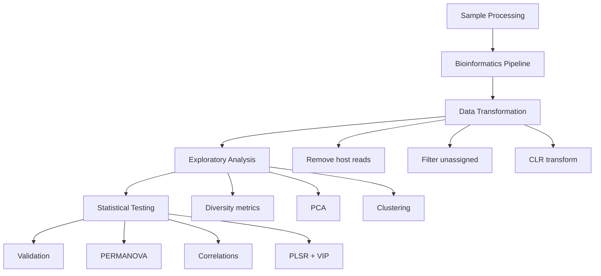
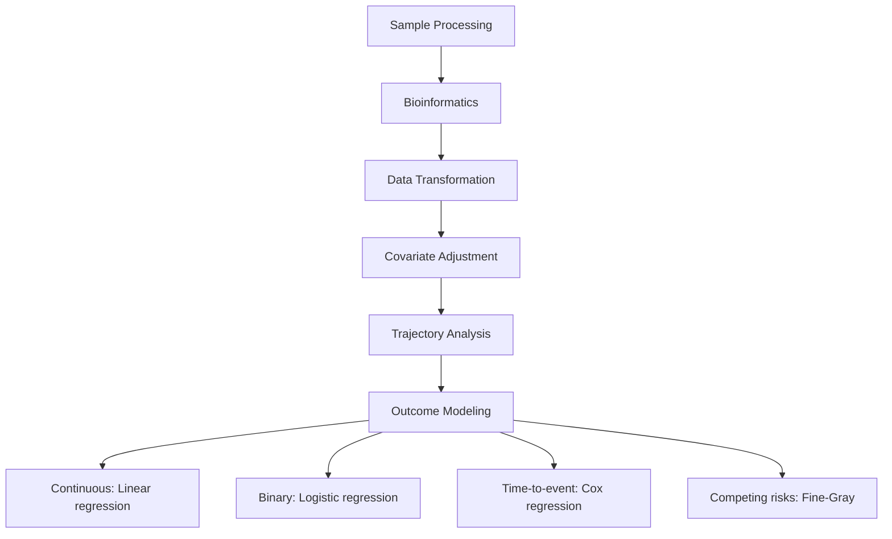

# Statistical Analysis Overview

This section provides standardized statistical methods for analyzing FoodSeq dietary DNA sequencing data. These methods have been validated across population surveillance, global dietary comparisons, and clinical outcome studies.

## What is FoodSeq?

FoodSeq is a DNA metabarcoding approach that identifies plant and animal dietary components from fecal samples by targeting:

- **Plant DNA:** Chloroplast trnL(UAA) intron
- **Animal DNA:** Mitochondrial 12S rRNA (12SV5 region)

---

## Standard Workflows

### Population-Level Analysis



### Clinical Outcome Analysis



---

## Software and Packages

### Bioinformatics

| Package | Version | Purpose |
|---------|---------|---------|
| bcl2fastq | 2.20.0.422 | Demultiplexing |
| BBDuk | 38.38 | Adapter trimming |
| cutadapt | 3.4 | Primer trimming |
| QIIME2 | 2021.8-2022.11 | Pipeline framework |
| DADA2 | 1.10.0-1.18 | Denoising, taxonomy |
| phyloseq | 1.32.0-1.38.0 | Data organization |
| decontam | 1.8.0 | Contamination removal |

### Statistical Analysis

| Package | Version | Purpose |
|---------|---------|---------|
| vegan | 2.6-4 | PERMANOVA, diversity |
| microbiome | 1.16.0-1.28.0 | CLR, diversity metrics |
| pls | - | Partial least squares regression |
| lme4 | 1.1-35.5 | Mixed-effects models |
| lmerTest | 3.1-3 | P-values for lmer |
| survival | 3.7-0 | Cox regression |
| cmprsk | 2.2-12 | Competing risks |
| pROC | 1.18.5 | ROC analysis |

### Visualization

| Package | Purpose |
|---------|---------|
| ggplot2 | General plotting |
| ggpubr | Publication figures |
| circlize | Circos plots |
| patchwork | Figure composition |

---

## Multiple Testing Correction

When performing many statistical tests, correct for multiple comparisons:

### Benjamini-Hochberg FDR

Controls the false discovery rate (recommended for exploratory analysis):

```r
p_adjusted <- p.adjust(p_values, method = "BH")
significant <- p_adjusted < 0.05
```

### Bonferroni Correction

Strict family-wise error rate control (for confirmatory analysis):

```r
p_adjusted <- p.adjust(p_values, method = "bonferroni")
```

---

## Quick Reference

### Essential R Commands

```r
# CLR transformation
library(microbiome)
ps_clr <- transform(ps, "clr")

# PCA
pca <- prcomp(t(otu_table(ps_clr)), center = TRUE, scale. = FALSE)

# PERMANOVA
library(vegan)
adonis2(otu_table(ps_clr) ~ group, data = sample_data(ps), permutations = 1000)

# Spearman correlation
cor.test(x, y, method = "spearman")

# Mixed-effects model
library(lme4); library(lmerTest)
lmer(outcome ~ fixed + (1|subject), data = df)

# Cox regression
library(survival)
coxph(Surv(time, status) ~ predictors, data = df)

# PLSR with VIP
library(pls)
plsr(y ~ ., data = df, validation = "CV")
```

---

## Section Guide

| Page | Content |
|------|---------|
| [Data Transformations](transformations.md) | CLR, scaling, log transforms |
| [Correlation Analysis](correlation.md) | Spearman, Pearson tests |
| [Multivariate Tests](multivariate.md) | PERMANOVA, ANOVA |
| [Regression Analysis](regression.md) | PLSR, mixed effects, GLM |
| [Survival Analysis](survival.md) | Cox, Kaplan-Meier |
| [Clustering Methods](clustering.md) | Hierarchical, time-series |
| [Classification & ROC](classification.md) | ROC curves, AUC |
| [Reporting Standards](reporting.md) | Thresholds, visualization |
